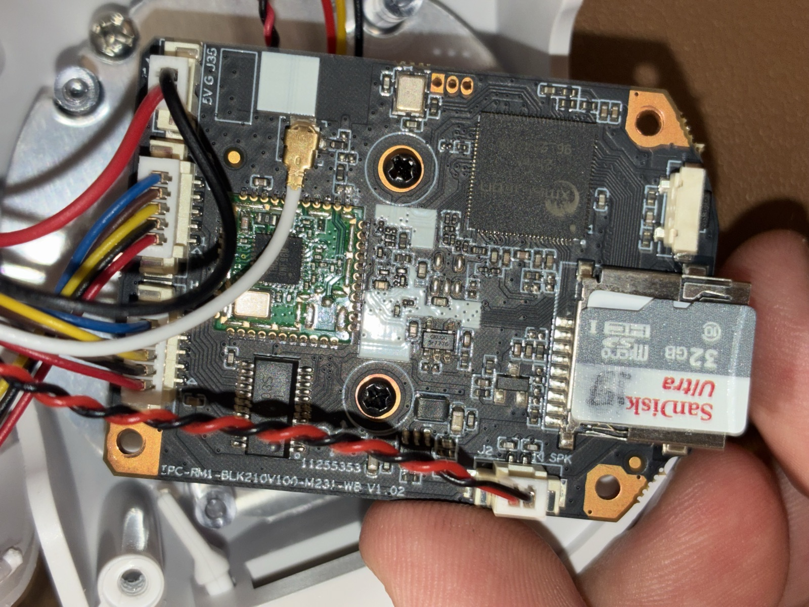
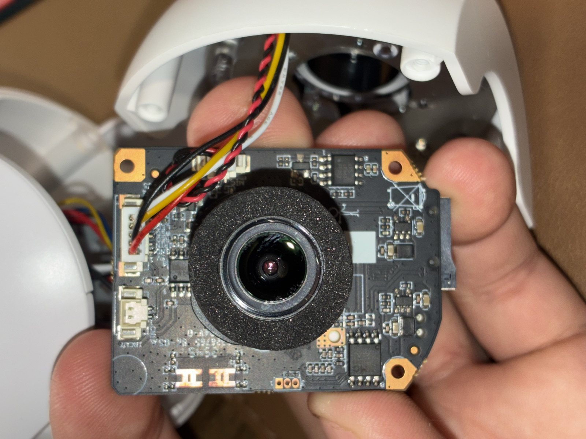
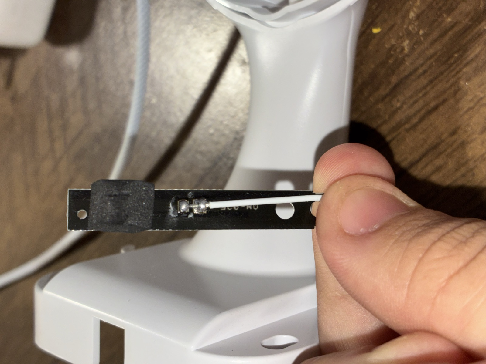
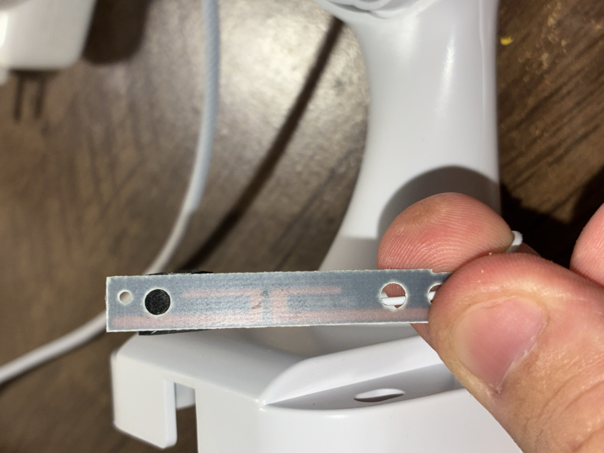
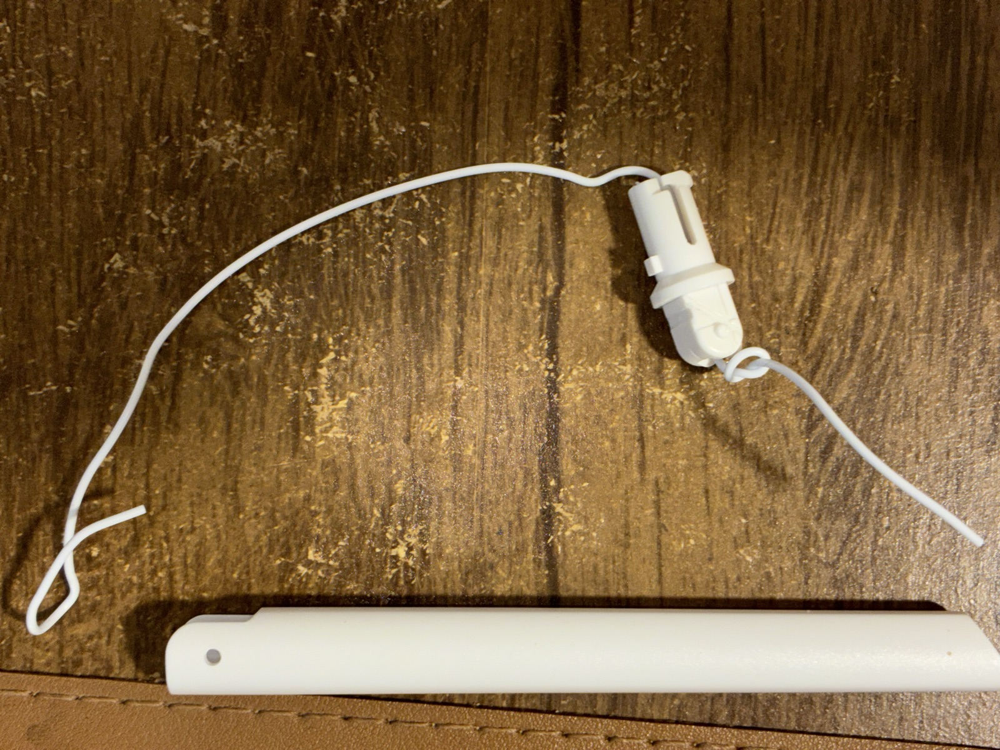

# Xiongmai XM210 (`IPC_XM210_X2-WR-T_S38`) teardown notes

Teardown and firmware analysis of a cheap "iCSee"-branded Wi-Fi IP camera
built around the Xiongmai **XM210** SoC. Based on a physically disassembled
unit plus the vendor's own firmware update package (mirrored, see
[Firmware](#firmware)).

**Status: stuck at the UART / shell stage.** See [UART findings](#uart-findings).
Issues and PRs welcome, especially a second board revision or a way past the
silent console.

## Camera review

Major Wi-Fi connectivity problems even at line of sight, reproduced across
2 units bought together, same model, so not a one-off defective unit. Out of
the box, with default encode settings, both were effectively unusable
through an NVR (continuous connection failures, see
[Known issues: antenna](#known-issues-antenna)). Stabilized (not fully
solved) by setting custom encode parameters: second/detect stream off, main
stream CBR 1500 kbps, 8 fps, audio on. Default settings were not stable
enough to use as shipped.

Daytime image quality: acceptable for general monitoring, not for reading
license plates, faces not identifiable past ~10m.

Price: under $25 USD (2026). **Verdict: not worth it for anything serious,
especially an NVR like Frigate.** Good enough only for basic monitoring with
local SD card recording and low expectations.

## Hardware

| | |
|---|---|
| Board silkscreen | `IPC-RM1-BLK210V100-M321-WB V1.02` |
| Main SoC | marked "xmsilicon 210WF 96_254508", RISC-V. No public datasheet found. |
| Wi-Fi | `SV6158`/`SSV6158M`, iComm Semiconductor. 2.4 GHz 1T1R 802.11b/g/n (some variants add BLE 5.0), SDIO 2.0 host interface. [FCC filing for a module using this chip](https://fcc.report/FCC-ID/2AATL-H158A-S/5240906.pdf). |
| Motor driver | ULN2803 (pan/tilt stepper), matches the PTZ feature |
| Antenna | two physical positions, only one is a real antenna. See [Known issues: antenna](#known-issues-antenna). |
| UART | 3 unpopulated through-hole pads, no silkscreen label. See pinout below. |

No second UART header found anywhere else on this board (checked both sides).

### UART pinout

Pad shape encodes pin 1 (standard PCB convention): pad 1 square, pads 2-3 round.

| Pad | Shape | Signal |
|---|---|---|
| 1 | square | GND |
| 2 | round | TX (camera → you) |
| 3 | round | RX (you → camera) |

115200 8N1, no flow control. Confirmed by continuity (GND) and voltage
behavior during boot (TX wobbles 0-3.3V while printing; RX sits flat).

### Photos

| | |
|---|---|
|  | Mainboard, top side. Main SoC bottom-left, microSD slot, Wi-Fi daughterboard (green PCB, center-right), UART pads below/right of the main SoC. |
|  | Image sensor board, separate from the mainboard, connected by a ribbon/wire harness. |
|  | The one real antenna: a PCB strip with a single soldered wire, no ground/shield conductor visible. |
|  | Same antenna, second angle. |
|  | The fake antenna position: plastic housing/rod, wire goes nowhere. Cosmetic only. |

## Known issues: antenna

Two antenna positions, only one is real: a PCB strip wired to the mainboard
by a single signal wire with no ground return (not a proper coax feed). The
other position is a plastic housing with a wire connected to nothing.
Cosmetic, there to make the camera look like it has two antennas. The
`SV6158` is 1T1R (single-antenna) anyway, so the dummy position was never
going to do anything even if it were real.

**Fix tested:** soldered the existing antenna cable to a common Wi-Fi pigtail
header and fitted a ~10cm gain antenna (cable reused, not replaced).
**Result:** Wi-Fi connection quality went from "unusable" (320+
reconnects/hour against an NVR, failing roughly every 10s) to "fair" (~1
reconnect/hour, holding for 40+ min observed). Real, sustained improvement,
but two other variables changed in the same test (different Wi-Fi network,
lower stream bitrate/single stream instead of two), so this isn't an
isolated antenna-only result. Not yet at parity with a wired reference
camera in the same spot. A clean single-variable retest is still open.

**Owner update, 2026-10-05 (reported by the camera's owner, not instrumented
by us):** the improvement held and also showed up on a second Wi-Fi network.
The owner reports the camera was very poor on both networks before the
antenna change and much better on both after it, and has no doubt the
antenna is what helped. That is evidence the gain is not just the network
switch, but it is an owner's observation, not a controlled measurement.

**Measured, from the NVR's own logs on 2026-10-05
(03:31 to 11:31, 8 h, camera at a new mounting spot, one disconnect counted per
RTSP timeout plus FFmpeg restart):** **24 drops, about 3 per hour (about 2 per
hour over the 17 h since the NVR restart), against about 320 per hour before
the antenna change, roughly 100 times fewer.** A wired reference camera on the
same NVR had 0 drops in the same window. The camera still drops a few times
an hour, but it went from unusable to a working wireless camera.

**Recommendation (owner's, based on this unit):** if you own this camera and
it drops off Wi-Fi, replacing the antenna with a pigtail plus an external
gain antenna is a worthwhile upgrade. It is the first thing to try before
blaming the router or the stream settings.

## Firmware

Vendor firmware for this exact hardware string (`IPC_XM210_X2-WR-T_S38`),
mirrored by the [OpenIPC xmupdates](https://github.com/OpenIPC/xmupdates)
project from Xiongmai's own update CDN:

| | |
|---|---|
| Catalog id | 2292 |
| Filename | `General_IPC_XM210_X2-WR-T_S38_WIFI.6158M_V5.07.R02.20260311_all.bin` |
| Version | `000999WP.1` |
| Build date | 2026-03-11 |
| SHA-256 | `de48bae57e982f10f368c0815cb9ef5365f6eed71650f8d22ba0f79473bedaa0` |
| Source | https://github.com/OpenIPC/xmupdates/releases/download/firmware-archive/id2292__000999WP.1__000999WP.1IPC_XM210_X2-WR-T_S38_V5.01.R02.zip |

Kept in [`firmware/`](firmware/) in this repo (hash above verifies it
against the upstream mirror). The physical unit tested runs a newer build,
`V5.08.R02.000999WP` (2026-04-23), same family, not byte-identical.
Contributions of that exact build welcome.

### Package contents

Plain zip, 5 files, each a gzip-compressed U-Boot "legacy uImage" wrapper:

| File | Role |
|---|---|
| `u-boot.bin.img` | ~8.6 KB RISC-V SPL/bootloader. Confirmed RISC-V from opcode bytes (`auipc`/`csrw`); the uImage header's "Linux/ARM" is just a container field. |
| `u-boot.env.img` | Bootloader environment. `osmem=7538K`, `ver=spl 2024.11`, matches the live camera's boot log. |
| `custom-x.cramfs.img` | CramFS, 786 KB. Extracted to [`firmware/custom-cramfs-extracted/`](firmware/custom-cramfs-extracted/): vendor default config (network/camera/encode/storage), UI strings, PTZ/RS-485 Squirrel scripts, fonts, audio prompts. Factory-default, not unit-specific. |
| `download.img` | ~2 MB main RTOS application image. See below. |
| `InstallDesc` | JSON describing the flash-partition "Burn" steps. |

Flash layout (`firmware/custom-cramfs-extracted/mtd`, 8 MB NOR total):

```
mtd0: 0x00004000  "boot"      (16 KB)
mtd1: 0x0040C000  "app"       (~4.05 MB)
mtd2: 0x00001000  "version"   (4 KB)
mtd3: 0x0025F000  "download"  (~2.4 MB)
mtd4: 0x000D0000  "custom"    (832 KB)
mtd5: 0x000C0000  "mtd"       (768 KB)
```

Vendor build manifest (`firmware/custom-cramfs-extracted/FirmwareInfo`):

```
CHIP=XM210
DEVICE=X2-WR-T
FLASH_TYPE=NOR, FLASH_SIZE=8M
DDR_TYPE=DDR3, DDR_SIZE=16M, DDR_FREQ=300
SDK_VERSION=V2.1.2.0
WIFI_TYPE=SSV6158M
SENSOR=SC2331
```

### The app payload: not encrypted

`download.img` unwraps (strip the 64-byte uImage header) to a second payload.
Byte entropy ~8.0 bits/byte (looks random at a glance), but it's **plain
LZMA**, no key:

```python
import lzma
open('app-decompressed.bin','wb').write(lzma.decompress(open('download-payload.bin','rb').read()))
```

Decompresses to 3,648,850 bytes. Stored as
[`firmware/app-decompressed.bin`](firmware/app-decompressed.bin), with a
`strings -n 3` dump at [`firmware/app-strings.txt`](firmware/app-strings.txt)
(15,500+ strings).

### RT-Thread, not Linux

Confirmed from `app-strings.txt`:

- `RT-Thread shell commands:`, `RTOS #`, `tshell`, `finsh: can not find
  device: %s`, `shell != RT_NULL`: RT-Thread's `finsh`/`msh` shell, compiled
  in.
- `MSH >pin num PA.16`: RT-Thread's `pin` command usage text.
- Leaked internal build path:
  `/home/share/zhangjing/XmBuilder_IPC/XM210/Packshop/MainApplication/RTThread/.//XM210/sd_factory.c`
- 8 MB flash / 16 MB RAM is too small for embedded Linux + BusyBox; fits an
  RTOS.

**OpenIPC targets Linux-capable Xiongmai SoCs (XM510/XM530/XM550) only.**
XM210 is a smaller, RTOS-only part. No open alternative firmware project
targets it as far as we've found.

### Two command interpreters

1. **RT-Thread's `finsh`/`msh`**, generic RTOS shell: `help`, `ls`, `cat`,
   `pwd`, `free`, `list`, `top`, `version`, `mount`, `ifconfig`, `ping`,
   `tftp`, `iperf`, `wifi` (`list_sta`, `ap_stop`, `smartconfig`), `telnet`
   (starts a telnet server).
2. **Xiongmai's "Sofia console"**, layered on top: `shell`, `quit`, `packet`,
   `reboot`, `date`, a log-level setter. Also has `name:/>` / `password:/>`
   prompt strings and a `console <CMD>` pattern, never observed live on the
   wire. Unclear if/when active.

## UART findings

115200 8N1, no parity, no flow control. Every power-on / `reboot` produces
this exact 226-byte boot log, byte-identical every time:

```
WDT: 0x00000014s
csi_mpu_config_region
Check Version OK
Boot...
flash init...ok
pll init.PLLC-2MPsensor.00003010.ok
psram init...000030100000000D
-wb-1-
-wb-2-
-wb-3-
-wb-4-
-wb-5-
 ok
board init osmem[7538K]
```

Then silence. Sent `shell`, `help`, `version`, `free`, `ls`, `pwd`, `date`,
`?`, `info`, `ps`, `mem`, `ifconfig`, `uname`, each with `\r`, `\n`, `\r\n`:
zero bytes back for all of them (verified with hex dumps of sent vs.
received, not just a blank terminal). Only `reboot` has any observable
effect.

**Likely cause:** RT-Thread binds its shell to one named console device at
boot (`RT_CONSOLE_DEVICE_NAME`, often `uart1`). These pads are probably the
SoC's boot UART (`uart0`). Only the early-stage loader writes to it; the
RTOS kernel then (re)binds `finsh` elsewhere, possibly a pin pair not broken
out on this board. Alternatively, the console may be gated by a stored flag
(`XmService_System_isUartDebugOpened` is in the binary) rather than a
different physical UART. Not disassembled far enough to tell which.

**Open:**
- A different board revision with a second UART header.
- RISC-V disassembly to pin down what `XmService_System_isUartDebugOpened`
  reads, and where `uart1`'s pins land on the SoC package.
- Any documentation on Xiongmai's XM2xx RTOS line (OpenIPC covers
  XM510/530/550 only).

## Tooling

[`tools/sofia-cam/`](tools/sofia-cam/): CLI and Python library used
throughout this investigation to talk to the camera over DVRIP/Sofia (TCP
34567): fingerprinting, reading config read-only, pulling a snapshot/stream.
Dependency-free, standard library only. Separate, reusable tool, not XM210-specific.

## Network-side findings (read-only)

Only TCP 34567 (DVRIP/Sofia) is open. No RTSP, no ONVIF, no web UI
(confirmed by port probe).

- `SystemInfo` config node: not supported by this firmware.
- `NetWork.Wifi` / `NetWork.NetCommon`: readable, standard fields.
- **`NetWork.NetCommon.HostIP` has repeatedly drifted to `192.168.1.10` on
  its own**, especially around power loss, needing manual reset (sometimes
  more than once). `.10` is a common default/gateway-adjacent address, so
  this causes a real IP conflict on networks where something else owns it.
  Symptom looks like "great signal, won't connect" rather than an obvious
  conflict, since only traffic to/from the conflicting host gets
  misdirected. No trigger identified. Check this field before chasing a
  Wi-Fi theory.
- `General.AutoMaintain`: weekly scheduled auto-reboot by default.
- `NetWork.NetNTP`: phones home to `time.windows.com`, `0.pool.ntp.org`, two
  `.cn` hosts, by default.
- **Neither signal-reading path can be trusted.** DVRIP's
  `NetWork.WifiRouteInfo.SignalLevel` exists but returned `null` every time
  (polled 5×). The iCSee/XMEye app's own indicator, tested against a
  deliberately bad placement (~5 walls from the AP), reported "very good."
  Any signal test needs an independent measurement (AP-side RSSI, packet
  loss), not anything the camera or app self-reports.
- No node exposes a debug/telnet/shell toggle over the network.

### No RTSP / ONVIF

`NetWork.NetRTSP` / `NetWork.OnVif` config writes succeed and persist, but
this firmware ships no RTSP/ONVIF server binary. Nothing actually starts.
A DVRIP write succeeding doesn't mean the port opened; verify separately.

Getting video out: bridge DVRIP yourself via [`tools/sofia-cam/`](tools/sofia-cam/).
Pulls the elementary H.264/H.265 stream, republishable as real `rtsp://`
with `ffmpeg -c copy` (Frigate/go2rtc/VLC), no transcoding. Examples in
[`tools/sofia-cam/README.md`](tools/sofia-cam/README.md).

## Suggested next steps

1. **Isolate the antenna variable.** The fix above changed three things at
   once; a clean retest (antenna only, same network, same stream config)
   would confirm how much of the improvement is actually the antenna. The
   owner's 2026-10-05 observation of gains on two networks narrows this.
2. **Settle the UART console question.** Disassemble around
   `XmService_System_isUartDebugOpened`, or find where `uart1` physically
   lands on the SoC package.
3. **Set up a RISC-V disassembler** (Ghidra + its RISC-V module, or similar)
   against `firmware/app-decompressed.bin`; none is checked into this repo
   yet. Document exact toolchain/commands if you add one.
4. **Scope a from-scratch firmware.** Needs a RISC-V toolchain, an RT-Thread
   BSP for the XM210's peripherals (ISP/sensor for the `SC2331`, H.264/H.265
   encoder, PTZ driver, `SSV6158M` SDIO Wi-Fi driver), and a flashing path
   (next item). Large undertaking, nothing public exists for this chip yet.
   Worth it only if 2-3 turn up something promising.
5. **Work out a flashing path.** Untested so far. The vendor's own OTA/
   SD-card mechanism (`InstallDesc`, `sd_factory_upgrade` strings) is the
   safer first test, confirm a stock re-flash works before trying anything
   custom. SPI/NOR clip read/write (no desoldering for an 8-pin SOIC) is the
   fallback; note the firmware isn't encrypted, so a flash *read* alone adds
   little over what's already in this repo. A *write* is the open question.
6. **Check other board revisions for a second UART header.** Only one
   physical unit examined here.

## Contributing

AI agents: read [`AGENTS.md`](AGENTS.md) first (secret-handling rules,
claim-labeling conventions).

Useful contributions: a working path into the RT-Thread `finsh` shell;
disassembly of `firmware/app-decompressed.bin`; an isolated antenna
before/after measurement; any public documentation of the XM210 SoC or other
cameras sharing this board (`IPC-RM1-BLK210V100-M321-WB`).

## License

MIT, see [LICENSE](LICENSE). The mirrored vendor firmware in `firmware/`
remains Xiongmai's own copyright, republished here for research purposes
(same spirit as the [OpenIPC xmupdates](https://github.com/OpenIPC/xmupdates)
mirror it came from).
